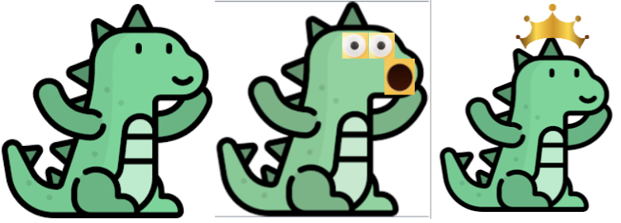

# On Occlusions in Video Action Detection: Benchmark Datasets And Training Recipes

### [Paper](https://openreview.net/pdf?id=0cltUI2Sto) | [Poster](https://neurips.cc/media/PosterPDFs/NeurIPS%202023/73721.png?t=1699494223.0217297)| [Data](dummy) | 

[Rajat Modi](https://www.linkedin.com/in/rajat-modi-54377877?originalSubdomain=in),
[Vibhav Vineet](https://scholar.google.com/citations?user=E_UlAVQAAAAJ&hl=en),
[Yogesh Singh Rawat](https://scholar.google.com.sg/citations?user=D_JvEcwAAAAJ&hl=en)


This is the official implementation and dataset release for our **NeurIPS 2023** paper titled: "On Occlusions in Video Action Detection: Benchmark Datasets And Training Recipes".

## Updates


- `2024.04`:  GLOM could be made to work. Surely you are joking, Mr. Feynman. Stay tuned (lol).....
- `2023.12`: [NeurIPS23] Check out our other exciting work which studies occlusions in action recognition [here](https://shroglck.github.io/rev_unseen/) !!

## GLOM: Hinton's Islands of agreement. 

> "A Static Image is (A) Rather Boring Video- Dr. Geoff Hinton, Forward Forward Algorithm: Some Preliminary Investigations "


**Working Principle:** Let a boring static image be repeated T=8 times (number of frames) along the temporal axis. It then becomes a boring video which doesnt change through time. Then, it is pumped through a VIDEO- transformer and output values of lower attention layers are visualized via simple t-sNE clustering. We can see the islands. Repeating the video does a subtle thing: it bypasses the singular fixation assumption. Duplicate input allows the net to settle on a stable representation. **No more fancy boxes, semantic labels, upsampling, explicit decoders or other fluff [GLOM]**. Grouping happens as a part of bottom-up recognition only.  Islands of agreement have thus been observed now in transformers. **Official** OpenReview Discussions with our respected AC's,SAC's and PC's can be found [here](https://openreview.net/forum?id=0cltUI2Sto&referrer=%5BAuthor%20Console%5D(%2Fgroup%3Fid%3DNeurIPS.cc%2F2023%2FTrack%2FDatasets_and_Benchmarks%2FAuthors%23your-submissions)). Part-whole parse-trees have been entangled (for now). Qualitative results presented below **haven't been** cherry-picked. Geoff sir holding an anaconda can be found [here](data:image/jpeg;base64,/9j/4AAQSkZJRgABAQAAAQABAAD/2wCEAAkGBwgHBgkIBwgKCgkLDRYPDQwMDRsUFRAWIB0iIiAdHx8kKDQsJCYxJx8fLT0tMTU3Ojo6Iys/RD84QzQ5OjcBCgoKDQwNGg8PGjclHyU3Nzc3Nzc3Nzc3Nzc3Nzc3Nzc3Nzc3Nzc3Nzc3Nzc3Nzc3Nzc3Nzc3Nzc3Nzc3Nzc3N//AABEIAFwAXAMBIgACEQEDEQH/xAAcAAACAgMBAQAAAAAAAAAAAAAFBgQHAAIDAQj/xABCEAABAwIEAQcIBgkFAQAAAAABAgMRAAQFEiExBgcTIkFRYbEjMnFygZHBwjNSYoKh0RRCU1Rjc3ST4RaSorLwFf/EABcBAQEBAQAAAAAAAAAAAAAAAAECAAP/xAAcEQEAAwEAAwEAAAAAAAAAAAAAAQIxESEiQRL/2gAMAwEAAhEDEQA/APOWNDqrjB+bIjI9MjvRVeBm7Oykf7atDlVbzPYX3Jd+SkhLUDauNJ9V20LS1eDZ1I+5U23LjtipThCnElQkabE1J5sCtMOSCzcJ+q6ofgDVBubR55tosvqaOUE5QDMiureG3Z3v7j2QKmYfCmGj2tpP4CiTSe6ghbeEOq86/u/Y4RW6sFX+/wB9/fV+dGEpg17mE60sVsXw02lk6+m7ulKQmek8o/GiC25v9Ny0fEVvxLBwi6j9ma2cMXrZ7WleKawO3JtaG0wi6Qp917NdFUurKiOgkQO7Sg6/PXt5xph4FM4dcR+8H/qKX1GFr0/WNFNlrY6cqH0uG+q78lJAp15TvpsM9V3xRSXpFTTFW14da5WGhuh/Fn/iK61Ht9X7puTqEnTvBHwq0jmBG0Uy0l98Z0pCFNt6kGOujirEEByzlxo6biZqusLXzbaLNLhadU8CHYkk7RVg2pbxVpYY59m7sjMZtFR2jqrS0ORPdWqSc2tYpQIkFKh2pMj31zk0MhcQQcKuh/DV4VycVNyye1lXiitsZJVhtz/LV4VyX9Pbd7KvFFLLH4C1w25/qPlFLy/PXH1jR7k8JOGXX9R8ooGtRDix9o0V1rYzlR0uMMH2HfFFJYHpp55TGHnnsN5hhTsJdmEkxqjspQbw3E1HoWS/7aqmmKtqLEGo7Ol/cAjQto8VUXGDYuRP6IuB9j86x3BL+2acun7YISlBUtalJEJGuutX1Ml1ofoIS7zaF9MlpZM5cq9vwqx7TGlPJLzFsfKtFxRDcBRjsnb00i4TYtYtzxunXeihRbbR9bfSnngxVmhLLbJuEuiZQ70th1KGkGQR/itLQGlxMnKhKR1JSNB6KyCo6JPuphu7Fi9R5JtVo8ToCuR7Y0qOeGX1eddx900EuYoypVhcJCFkltWmU9lQcxLlqD53MH5KbxwoAoZrsd55v/Nap4PZDiXHL11akggHIkaGPyp6ODfJ3H/y7mDM3G/3RQB76Zz1z403cK4a1hlo8yypSgp2derQUpvAc+766vGtXWthwxU5VNaHY/CoQcAGta8U3PMKt/KIRIVotUTtQX9OABi5RoJneuVcXbRwupAnqoBx+Fq4SvubUUkZCY6050yPdXiMRaPQVdII00FcuIH0XWA37HOElbCsspgSBI19Iq4hMq54dcCrjmipaSZhSN098ddOeCY6zg9xzV2oE5y2ChJVkVuD25YIAqucNueYvWnJIyqFFbvFwniFm7DQbSjLKYkadcf+2rpMJ6fb3ErG7xFu1tcVdbzNlaFNticw086fl0g0iucRYizerSt1wvZsq8rq9wdQJJ3Ijasx1pl59zGGVqUhbyylKSBOv1d077dlOHD901imDrXdYfbONuOKAlI6UxPV2yKMKTwvxErEmy3cvOKIiVSATqdd56oIG1NC1IJI5xURr0yIFVhhLbWGXV68sFFrLnNI6OZaAomAT1QnQ+MU4qdvVsoGRaJA6IaO/wATRMNBv4fdZdtXkWp8ml2Ce0wCfGk90eVc9Y+NNHByHU2Vxz5Ml7SUx+qKV3vp3fXV40V1rYPcX2xectFJIGULklIPZS7c2Z5tJ59Z1GaNCB76mcpXEKsDcw9CLYPF9Dpkry5cpT3d9IVzxzduiE2bSfSsn4VFKzxVp8mO5sWYUOccIkZpI1/Cg1xapYs7xDXOuBTaoHbodqEO8ZYofMRbp+4T8agu8T4q4VDnG0ykp6LY2rrESnoYtCkw4gkxuIrgt9RdCwTn7T1V4hQ26WmgqbZYcp7m3bjM2w4vKgwCtw9iE9fp2HbMA0k0cKWTOOvNt4qlt1pbjiirMptW0yI7xvPdTLxNxNZcN2CMJwJCE3CU5U5RIYT9YjrPp9J70niJ1yxYw+1t0lhhVslwJBOYkqVqpUAn3AamBS6FLdVnUdzqomjnT0y8NNIxLFUKvnmUWzag9cPOLgqIOiZPbA0GgAqwbziXBIKlYlbkpPRhwH21TobkEiIHWSK0UnXzhp308br6L4FxC3xTD7l61eS8lNxlJT1HKnT8aXXky+766vGs5DyUcO4iIhRvpE/y0Vs4fLOzvzivGojxLWwH5cFlF1gkfs3/ABbqrlvqI0ira5ZrZD93g2cnRD+33Pyqs2LNl1talAyO/urUn1NtDFOLPWa1bS444EolSlaAUdaw63DQVlkzGtdUWVvA6Gh3HbVdAUhy0soKUIu3xuVjyKfQP1/bA7lCstHXLvGrd25WXXHHkZlK1J17NvZsKhuJCXnANgsge+iPDDSX8fsUL25yfcCfhSDLynMJaThBRoMjiDsJAyxS4zw/iNyguss5mozBU7imPlJcUbvDWlQUpQ57dUj4Uz8JLy4JZoAEBECfSaO8g/Vds8M4m6tSG2ApSTBGuh91Sv8AS2IpbBQwS5Op0hPvOtWQpZadeSgAAyowIk99cbhRUy6mSBlnQxR+pPBHkjw64wvAr4XsZ3bzONZkZEj4Gor2rzhHWtXjRzk7JdwQrWSVF3c+qKBO6Or9Y+NFda2P/9k=)

<div align="center">

</div>

<div align="center">

</div>


We release the code to try the islands of agreement on **any image in-the-wild**. Navigate to `codebase/codebase_islands/` directory. For environment installation, kindly follow the installation process outlined in official slowfast repo [here](https://github.com/facebookresearch/SlowFast/blob/main/INSTALL.md). This code has been tested with pytorch 1.13.1 , cuda 11.6, with ubuntu 22.04. Note that it shall only suport gpus greater in generation than turings. The most recent one was Hopper at the time of writing this readme. (April 10, 2024).


```
!!install slowfast environment first 
conda activate slowfast
cd codebase/codebase_islands/
bash download.sh 
python hinton_islands.py
```
you can place your own image in the `codebase/codebase_islands/` directory and rename it accordingly. Please feel free to raise an issue [here](https://github.com/rajatmodi62/OccludedActionBenchmark/issues) if you face any sort of troubles. This repo is just maintained by a small student: i will try to get to your issue whenever i can. Thanks for your kind understanding.

**t-sne too slow**: visualization relies on t-sne. it parallelizes on a cpu but is too slow. [tsne-cuda](https://github.com/CannyLab/tsne-cuda) is good, but doesnt work beyond 2 components. But, the mechanism presented above projects it to 3 dimensions. The general principle is same as entropy in thermodynamics: the more dimensions you can visualize, the more you see. I could only think of a 3D visualization: treat the vectors as an image. Maybe, i will write a faster variant of tsne on cuda later on, when i get time. If there exists a way to visuliaze >3 dimensions at the same time, please do let me know. 
## What is wrong with capsules?

>" The fundamental weakness of capsules is that they use a mixture to
model the set of possible parts. This forces a hard decision about whether a
car headlight and an eye are really different parts. If they are modeled by the
same capsule, the capsule cannot predict the identity of the whole. If they are
modeled by different capsules the similarity in their relationship to their whole
cannot be captured. If we want to make neural networks that understand images in the same way as people do, we need to figure out how neural networks can represent part-whole hierarchies. This is difficult because a real neural network cannot dynamically
allocate a group of neurons to represent a node in a parse tree
. The inability of neural nets to dynamically allocate neurons was the motivation for a
series of models that used “capsules”- Dr. Geoff Hinton, GLOM "

We now confirm that capsules undergo collapse if too many objects are present in the scene. This is a problem with all other models including transformers: their memory increases with number of objects in the scene.

<div align="center">

</div>

**The post-alexnet/transformer/llm era-scientist**: Well ok, that's interesting. so what? How do we solve it? If it doesn't work, it doesn't work. I'd rather use something which works **today**. Well, read the slow science manifesto [here](http://slow-science.org/). Some notable people (trying) to support it are [1](https://people.eecs.berkeley.edu/~efros/),[2](https://vilab.epfl.ch/zamir/).
## Dataset Release.

Ok, so capsules/transformers face some fundamental issues. What happens when number of objects in a scene scale up? To answer this, we **release** all the datasets used in this paper. There has to be a way to study this thing properly. **We don't like making the users download zips**[Thanks, steven dick!!](https://www.cecs.ucf.edu/techsupport/staff.php): you have to download them first, and unzip it. That occupies double the memory and takes too much time to unzip. So, we release a mountable squash format for all the datasets [here](). Hopefully, it makes it direct plug and play. Downloading a large giant file is faster than downloading a large number of small files. The statistics of the dataset can be observed as below:
<div align="center">

</div>

**The Angry Reviewer**: Hey, what about real world? Well, we release a realistic dataset too. 

**The Software Developer**: Hey, i want a simple way to use the dataset. Well, we support huggingface too.  


## Instructions to use dataset (Mounting Squash)
Squashfs images can be unpacked in windows with 7-zip. The main fork 7-zip doesn't support lz4 compression, but this one does.
In linux, they can be directly mounted or mounted with squashfuse. For example, either:

mount directly with the command: `sudo mount -o loop,ro image1.sq /mnt/image1` (no additional software needed)
mount with squashfuse: `mkdir image1; squashfuse image1.sq image1`

obviously, image1 here is the name of the squash you download.
## Dataset Samples: O-UCF.
Consists of static/dynamic occlusions on top of official UCF-24 dataset. Annotation labels remain same as official UCF-24 and can be found [here](https://drive.google.com/drive/folders/1BvGywlAGrACEqRyfYbz3wzlVV3cDFkct). Occluded Test set can be found [here](). 

<div align="center">

</div>


## Dataset Samples: O-JHMDB.
Consists of static/dynamic occlusions on top of official JHMDB-21 dataset. Annotation labels remain same as official JHMDB-21 and can be found [here](https://drive.google.com/drive/folders/1BvGywlAGrACEqRyfYbz3wzlVV3cDFkct). Occluded Test set can be found [here](). 

<div align="center">

</div>


## Dataset Samples: OVIS-UCF.

<div align="center">

</div>

Consists of realistic occluders from YouTubeVIS placed on top of  on top of UCF-24 dataset . Annotation labels remain same as official UCF-24 and can be found [here](https://drive.google.com/drive/folders/1BvGywlAGrACEqRyfYbz3wzlVV3cDFkct). Occluded Test set can be found [here](https://www.crcv.ucf.edu/data1/rajat_occ_action_detection/mso-ovis_ucf.sq). 
## Dataset Samples: OVIS-JHMDB.
Consists of static/dynamic occlusions on top of official UCF-24 dataset. Annotation labels remain same as official JHMDB-21 and can be found [here](https://drive.google.com/drive/folders/1BvGywlAGrACEqRyfYbz3wzlVV3cDFkct). Occluded Test set can be found [here](https://www.crcv.ucf.edu/data1/rajat_occ_action_detection/mso-ovis_jhmdb.sq). 


<div align="center">

</div>


## Comparisons
We present the comparisons of our models with supervised baselines, as well as the full benchmark.
<div align="center">

</div>


## Full Benchmark Analysis 
### O-UCF Benchmark
<div align="center">

</div>

### O-JHMDB Benchmark
<div align="center">

</div>

### OVIS-UCF/ OVIS-JHMDB Benchmark
<div align="center">

</div>


## Acknowledgements. 

We thank  [Sindy Löwe](https://github.com/loeweX/RotatingFeatures) whose github repo inspired us to organize our own work. We are grateful to the amazing work of [Mvitv2](https://arxiv.org/abs/2112.01526) which serves as a backbone in our net. Finally, we thank Dr. Geoff Hinton sir for his amazing paper on [GLOM](https://arxiv.org/abs/2102.12627) and being a constant source of our motivations. Credits for the cute little dino icon go to our shephard [Soumik Ghosh](https://www.linkedin.com/in/soumikg08/). We thank [James Beetham](https://www.linkedin.com/search/results/all/?fetchDeterministicClustersOnly=true&heroEntityKey=urn%3Ali%3Afsd_profile%3AACoAAB_HfLUBmo0digOkhp0jnRph6fHdAdXMooE&keywords=james%20beetham&origin=RICH_QUERY_SUGGESTION&position=0&searchId=608d95be-f824-4559-9b52-bd8e05d1b2f4&sid=JGu&spellCorrectionEnabled=false)/[Gaurav Kumar Nayak](https://www.linkedin.com/in/gaurav-kumar-nayak-6227ba53/) for helping with proofreading. Finally, we are grateful to [Steven Dick]() for helping with the cluster/dataset hosting. 

## Please do consider citing us.

If you feel that whatever we have presented here helps you in some way, we shall be forever grateful if you cite us.
Thank you so much for your interest and valuable time.  

```
@article{modi2024occlusions,
  title={On Occlusions in Video Action Detection: Benchmark Datasets And Training Recipes},
  author={Modi, Rajat and Vineet, Vibhav and Rawat, Yogesh},
  journal={Advances in Neural Information Processing Systems},
  volume={36},
  year={2024}
}

@article{modi2022video,
  title={Video action detection: Analysing limitations and challenges},
  author={Modi, Rajat and Rana, Aayush Jung and Kumar, Akash and Tirupattur, Praveen and Vyas, Shruti and Rawat, Yogesh Singh and Shah, Mubarak},
  journal={arXiv preprint arXiv:2204.07892},
  year={2022}
}

@article{duarte2018videocapsulenet,
  title={Videocapsulenet: A simplified network for action detection},
  author={Duarte, Kevin and Rawat, Yogesh and Shah, Mubarak},
  journal={Advances in neural information processing systems},
  volume={31},
  year={2018}
}
  @article{grover2024revealing,
  title={Revealing the unseen: Benchmarking video action recognition under occlusion},
  author={Grover, Shresth and Vineet, Vibhav and Rawat, Yogesh},
  journal={Advances in Neural Information Processing Systems},
  volume={36},
  year={2024}
}
