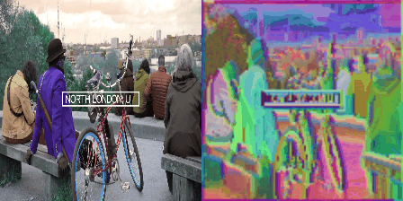
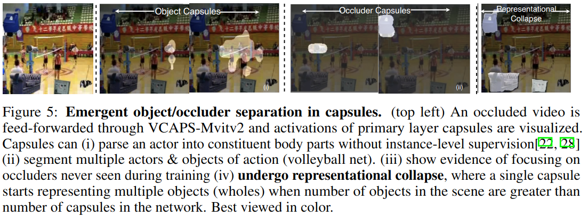
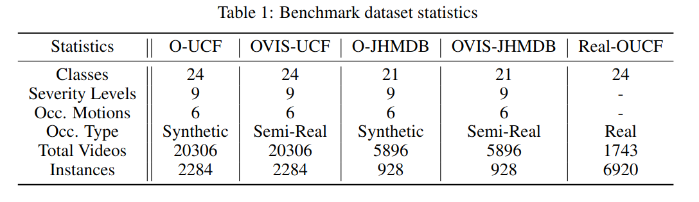

# On Occlusions in Video Action Detection: Benchmark Datasets And Training Recipes

### [Paper](https://openreview.net/pdf?id=0cltUI2Sto) | [Data](dummy) | [Poster](https://neurips.cc/media/PosterPDFs/NeurIPS%202023/73721.png?t=1699494223.0217297)

[Rajat Modi](https://www.linkedin.com/in/rajat-modi-54377877?originalSubdomain=in)\*,
[Vibhav Vineet](https://scholar.google.com/citations?user=E_UlAVQAAAAJ&hl=en)\*,
[Yogesh Singh Rawat](https://scholar.google.com.sg/citations?user=D_JvEcwAAAAJ&hl=en),

This is the official implementation and dataset release for our **NeurIPS 2023 paper** "On Occlusions in Video Action Detection: Benchmark Datasets And Training Recipes".

## GLOM: Hinton's Islands of agreement. 

> "A Static Image is (A) Rather Boring Video- Dr. Geoff Hinton, Forward Forward Algorithm: Some Preliminary Investigations "

**Working Principle:** Let a boring image be repeated T=8 times (number of frames) along the temporal axis. Then, it is pumped through a **VIDEO- transformer** and output values of lower attention layers are visualized via simple t-sNE clustering. We can see the islands. No fancy tricks. The net has been trained bottom-up for recognition only. **Islands have been observed now in transformers**. Official OpenReview Discussions can be found [here](https://openreview.net/forum?id=0cltUI2Sto&referrer=%5BAuthor%20Console%5D(%2Fgroup%3Fid%3DNeurIPS.cc%2F2023%2FTrack%2FDatasets_and_Benchmarks%2FAuthors%23your-submissions)).

## Limitations of capsules.

>" The fundamental weakness of capsules is that they use a mixture to
model the set of possible parts. This forces a hard decision about whether a
car headlight and an eye are really different parts. If they are modeled by the
same capsule, the capsule cannot predict the identity of the whole. If they are
modeled by different capsules the similarity in their relationship to their whole
cannot be captured. If we want to make neural networks that understand images in the same way as people do, we need to figure out how neural networks can represent part-whole hierarchies. This is difficult because a real neural network cannot dynamically
allocate a group of neurons to represent a node in a parse tree
. The inability of neural nets to dynamically allocate neurons was the motivation for a
series of models that used “capsules”- Dr. Geoff Hinton, GLOM "

We now confirm that capsules undergo collapse if too many objects are present in the scene. This is problem with all other models including transformers: their memory increases with number of objects in the scene.

## Dataset Release.

What happens when number of objects in the scene scale up? To answer this, we **release** all the datasets used in this paper [here](). 

## Dataset Samples: O-UCF.
Consists of static/dynamic occlusions on top of official UCF-24 dataset. Annotation labels are same as official UCF-24 and can be found [here](https://drive.google.com/drive/folders/1BvGywlAGrACEqRyfYbz3wzlVV3cDFkct). 

## Dataset Samples: O-JHMDB.
Consists of static/dynamic occlusions on top of official JHMDB-21 dataset. Annotation labels same as official JHMDB-21 and can be found [here](https://drive.google.com/drive/folders/1BvGywlAGrACEqRyfYbz3wzlVV3cDFkct)

## Dataset Samples: OVIS-UCF.

Consists of realistic occluders from YouTubeVIS placed on top of  on top of UCF-24 dataset . Annotation labels same as official UCF-24 and can be found [here](https://drive.google.com/drive/folders/1BvGywlAGrACEqRyfYbz3wzlVV3cDFkct)

## Dataset Samples: OVIS-JHMDB.
Consists of static/dynamic occlusions on top of official UCF-24 dataset. Annotation labels same as official JHMDB-21 and nd can be found [here](https://drive.google.com/drive/folders/1BvGywlAGrACEqRyfYbz3wzlVV3cDFkct). 

